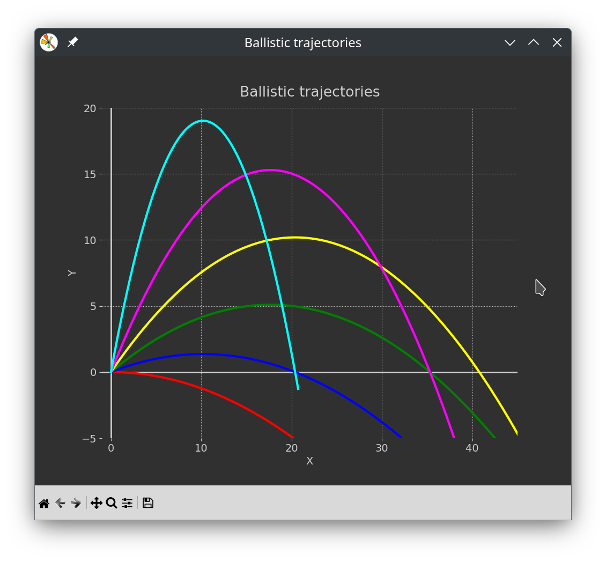

# Experimenting with animation in Matplotlib
These pieces of python code explore the animation facilities
of Matplotlib.

## Lissajous pattern

**matplotlib_animation_lissajous.py**

 It creates a oscilloscope like lissajous pattern when two signals are not locked in phase.

## Ballistic trajectories

**animation_ballistic_v2.py**

 

This python code explores the animation facilities of Matplotlib. It creates animated plots
of several ballistic trajectories. It uses list comprehension to process the multiple plots.
