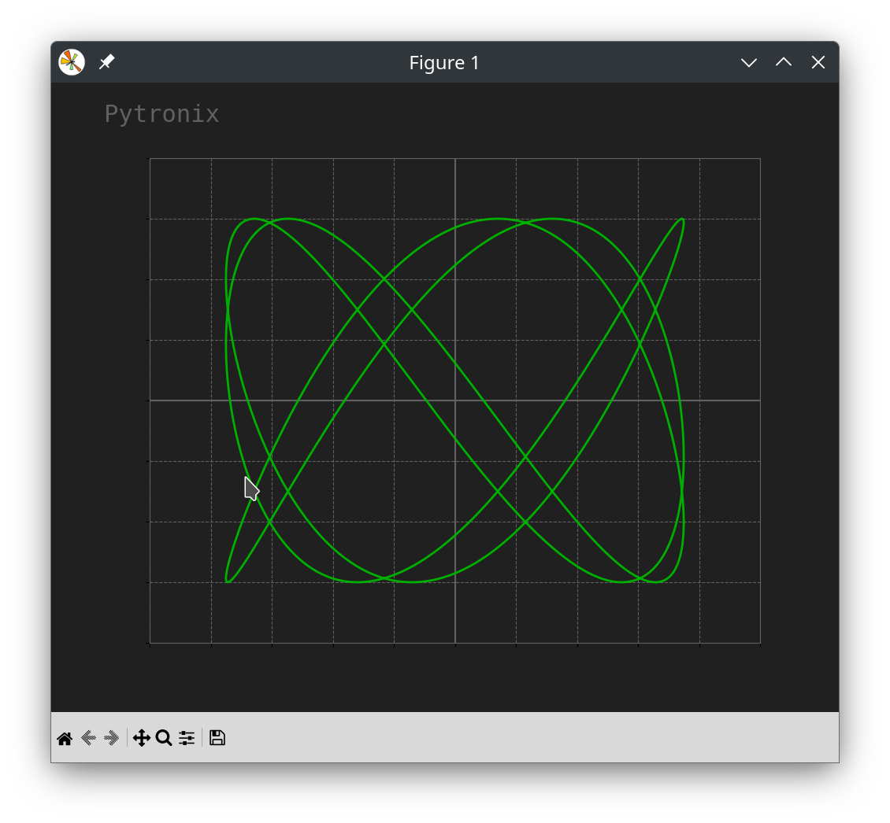

# Experimenting with animation in Matplotlib
These pieces of python code explore the animation facilities
of Matplotlib.

## Lissajous pattern

**matplotlib_animation_lissajous.py**

 It creates a oscilloscope like lissajous pattern when two signals are not locked in phase.
